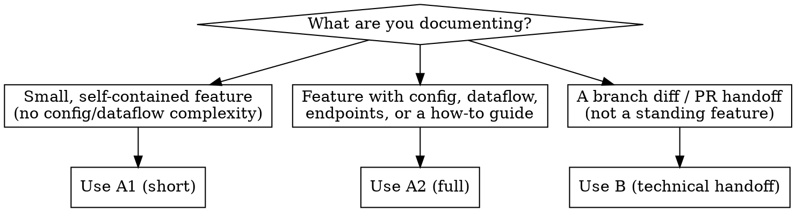

# Confluence Documentation

## Overview

The team's Confluence docs (Jobmatch/CGID) follow one of three fixed templates, derived from existing pages. Do not invent your own heading structure — pick the matching variant below and fill it in. Documentation is written in **Danish**.

## When to Use



If unclear which variant fits, ask the user rather than guessing.

## Templates

- `templates/a1-short.md` — Feature-dokumentation, kort variant. Small/simple features (e.g. "Jobspor", "Kompetencejagten").
- `templates/a2-full.md` — Feature-dokumentation, fuld variant. Features with architecture, config, endpoints, guides (e.g. "Visitationmodul", "i18n", "Umami-tracking").
- `templates/b-technical.md` — Teknisk branch/PR-dokumentation. A branch diff or handoff summary, not a standing feature.

Read the matching template file before writing. Copy its heading structure exactly (heading text and order) — only the content underneath is yours to fill in.

## Cross-Cutting Rules (apply to every variant)

1. **First section always answers "what is this and why does it exist"** — `## Beskrivelse`, `## Overblik`, or `## Formål og kontekst` depending on variant.
2. **Architecture/file structure is a fenced ` ```text ` code block showing a folder tree** — never prose-described.
3. **Configuration is always its own section with a concrete JSON/code example** — never only described in prose.
4. **How-to/guide sections are numbered `###` steps**, each with a code example where relevant.
5. **Known limitations, workarounds, and TODOs go in exactly one section** (`Q&A / Kendte begrænsninger`, `FAQ`, or `Midlertidige løsninger og kendte begrænsninger`) — do not scatter them through the text.
6. **Screenshots/UI flow steps use a two-column table**: `Beskrivelse | Billede`.
7. **Related files/Jira tickets/other features are listed at the end as references**, not inline.
8. **Written in Danish**, matching the existing documentation's tone.

## Common Mistakes

| Mistake | Fix |
|---|---|
| Inventing your own headings (e.g. "Status/Ejer/Sidst opdateret", "Brugerflow", "Fejlscenarier") | Use the exact heading names from the matching template |
| Describing folder structure in prose | Use a ` ```text ` mappetræ code block |
| Mixing config examples into prose paragraphs | Give config its own `## Konfiguration` section with a code block |
| Splitting limitations/TODOs across multiple sections | Consolidate into one Q&A/FAQ/limitations section |
| Picking a variant without checking scope first | Use the decision flow above; ask if ambiguous |
| Writing in English | Write in Danish |
